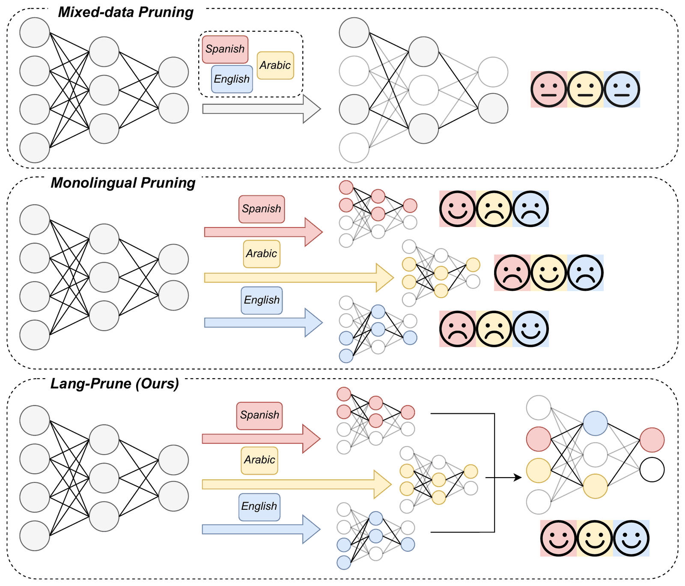

<div align="center">

# Lang-Prune

**Unlocking Fair and Powerful Pruning for Multilingual Large Language Models**

Juhao Liang<sup>1,\*</sup>, Shiqi Zhang<sup>1,2,\*</sup>, Min Zhang<sup>3</sup>, Hao Yang<sup>3</sup>, Benyou Wang<sup>1,2,†</sup>

<sup>1</sup>The Chinese University of Hong Kong, Shenzhen &nbsp; <sup>2</sup>Shenzhen Loop Area Institute &nbsp; <sup>3</sup>Huawei

<sup>\*</sup>Equal contribution &nbsp; <sup>†</sup>Corresponding author

[](https://colm.cc/)
[](https://openreview.net/forum?id=JY9Fy5tzdo)
[](LICENSE)
[](https://www.python.org/)

</div>

## News

- **2026-07**: Lang-Prune is accepted to **COLM 2026** (San Francisco, Oct 6–9).

## TL;DR

Pruning a multilingual LLM with mixed-language reference data causes **cross-lingual interference**: decisions that look good on average disproportionately damage particular languages. Lang-Prune computes structure importance **per language** on small reference sets and aggregates the scores with a **Max** operator, so any structure critical to at least one language is kept.

- On `aya-expanse-8b` across 9 typologically diverse languages, Lang-Prune cuts average perplexity by **62% at 70% sparsity** relative to mixed-data pruning, and beats monolingual pruning under the same reference-data budget.
- On `Qwen3-8B` at 50% sparsity, it reduces the average interference factor from **9.00× to 0.66×**, and the advantage grows with scale (0.6B → 14B).
- Pruned models keep more post-training capacity: **59.6% vs 50.6%** Belebele accuracy after identical LoRA fine-tuning.
- It is a drop-in change to [LLM-Pruner](https://github.com/horseee/LLM-Pruner): only importance estimation and aggregation are modified — no extra parameters, no retraining.

<p align="center">
  
</p>

## How it works

```
1. Per-language importance
   ┌─────┐  ┌─────┐  ┌─────┐  ┌─────┐
   │ ar  │  │ en  │  │ zh  │  │ ... │    Taylor importance computed
   │ imp │  │ imp │  │ imp │  │     │    independently per language,
   └──┬──┘  └──┬──┘  └──┬──┘  └──┬──┘    then min-max normalised
      │        │        │        │
      └────────┴───┬────┴────────┘
                   │
2. Max aggregation ▼
              max(imp_ar, imp_en, imp_zh, ...)
              "keep what any language needs"
                   │
3. Global pruning  ▼
              Prune the lowest-importance coupled structures
              until the target sparsity is reached
```

**Why Max?** A structure that is irrelevant for English can be critical for Arabic or Chinese. Mixing the reference data (or averaging scores) dilutes these language-specific peaks; Max preserves them.

The dependency-graph construction and pruning mechanics are inherited unchanged from LLM-Pruner.

## Results

Per-language perplexity on the mC4 validation split after pruning `aya-expanse-8b` to **70% sparsity** (lower is better; paper Table 2):

| Method | Ref. data | ara | ces | deu | eng | spa | ind | heb | rus | zho | **Avg** |
|---|---|---|---|---|---|---|---|---|---|---|---|
| Unpruned | – | 8.10 | 10.46 | 10.66 | 10.50 | 9.58 | 12.77 | 11.19 | 11.13 | 10.27 | 10.52 |
| LLM-Pruner | monolingual | 42.71 | 81.99 | 82.82 | 236.44 | 85.19 | 77.52 | 46.87 | 57.73 | 36.47 | 83.08 |
| LLM-Pruner | mixed | 80.99 | 164.12 | 245.65 | 378.39 | 227.26 | 173.63 | 71.97 | 127.51 | 226.88 | 188.49 |
| **Lang-Prune-Max** | multilingual | 44.03 | 69.71 | 64.85 | 158.33 | 72.53 | 70.08 | 51.62 | 60.29 | 46.18 | **70.85** |

Average perplexity across sparsity levels:

| Method | 30% | 50% | 70% |
|---|---|---|---|
| LLM-Pruner (monolingual) | 16.04 | 29.16 | 83.08 |
| LLM-Pruner (mixed) | 17.44 | 43.90 | 188.49 |
| **Lang-Prune-Max** | **14.90** | **25.91** | **70.85** |

Scaling on the Qwen3 family at 50% sparsity (average interference factor vs. monolingual pruning, lower is better; paper Table 5):

| | 0.6B | 1.7B | 4B | 8B | 14B |
|---|---|---|---|---|---|
| LLM-Pruner (mixed) | 1.10× | 2.22× | 1.24× | 9.00× | 8.04× |
| **Lang-Prune** | 1.18× | 1.25× | **0.96×** | **0.66×** | **0.46×** |

All runs use 100 sequences of length 128 per language (900 in total for every method). Individual reruns can differ from the paper numbers by roughly ±10–15% depending on the random seed; rankings and relative improvements are stable.

## Quick start

```bash
# 1. Environment
conda create -n langprune python=3.10 -y && conda activate langprune
pip install torch==2.3.0  # CUDA 12.1 or 11.8, see INSTALL.md
pip install -r requirements.txt

# 2. mC4 data for the 9 reference languages (downloads to ./data/c4/)
python scripts/download_mc4.py

# 3. Prune Aya-Expanse-8B at 70% sparsity
export BASE_MODEL=/path/to/aya-expanse-8b
bash scripts/run_aya.sh
```

See [INSTALL.md](INSTALL.md) for PyTorch setup, data preparation and model download.

## Data

Lang-Prune uses language-specific mC4 shards from [`allenai/c4`](https://huggingface.co/datasets/allenai/c4). `scripts/download_mc4.py` fetches exactly the files listed in `lib/datasets/languages.py`:

```
data/c4/
├── multilingual/c4-ar.tfrecord-00000-of-01024.json.gz
├── multilingual/c4-ar-validation.tfrecord-00000-of-00004.json.gz
├── multilingual/c4-zh.tfrecord-00000-of-01024.json.gz
├── multilingual/c4-zh-validation.tfrecord-00000-of-00002.json.gz
├── en/c4-train.00000-of-01024.json.gz
├── en/c4-validation.00000-of-00008.json.gz
└── ...
```

Use `--all` to also fetch the out-of-distribution languages, or `--splits validation` if you only need evaluation shards.

## Running experiments

### Lang-Prune (our method)

```bash
python main.py \
    --base_model /path/to/model \
    --save_ckpt_log_name my_experiment \
    --pruning_ratio 0.7 \
    --block_wise --global_pruning \
    --block_attention_layer_start 0 --block_attention_layer_end 32 \
    --block_mlp_layer_start 0 --block_mlp_layer_end 32 \
    --multi_lang_important True --merge_methods max \
    --calibration_languages ar iw cs ru de en es id zh \
    --eval_languages ar iw cs ru de en es id zh \
    --multilingual_eval \
    --num_examples 100 \
    --test_after_train --save_model
```

With `--multi_lang_important True`, `--num_examples` is the number of sequences **per language**.

### LLM-Pruner baseline (mixed-data)

Use `--multi_lang_important False --num_examples 900`. This pools all reference data (900 sequences, split evenly across languages) before importance estimation, which is the standard approach in prior work.

### Convenience scripts

```bash
bash scripts/run_aya.sh                      # Lang-Prune on Aya-Expanse-8B, 70% sparsity (Table 2)
bash scripts/run_aya_llmpruner_baseline.sh   # LLM-Pruner mixed-data baseline
bash scripts/run_qwen.sh                     # Lang-Prune on Qwen3-8B, 50% sparsity, 25-language eval (Table 25)
bash scripts/run_reproduction.sh all         # Main reproduction suite (add --dry-run to print commands)
```

The scripts read the model path from `$BASE_MODEL` (or `$AYA_MODEL` / `$QWEN_MODEL` for `run_reproduction.sh`).

### Key arguments

| Argument | What it does |
|----------|-------------|
| `--multi_lang_important True` | Per-language importance estimation (Lang-Prune) |
| `--merge_methods max` | Max aggregation — **Lang-Prune-Max**, default and recommended |
| `--merge_methods mean` / `min` | Mean / Min aggregation (Lang-Prune-Avg / Lang-Prune-Min ablations) |
| `--calibration_languages` | Reference languages used for importance estimation |
| `--num_examples` | Reference sequences per language (Lang-Prune) or in total (mixed-data) |
| `--pruning_ratio 0.7` | Target 70% sparsity |
| `--block_wise --global_pruning` | Block-wise structured pruning with global ranking |
| `--test_after_train` | Evaluate PPL after pruning |
| `--save_model` | Export the pruned model to HuggingFace format |

### Unpruned baseline

```bash
python main.py \
    --base_model /path/to/model \
    --save_ckpt_log_name unpruned_baseline \
    --eval_languages ar iw cs ru de en es id zh \
    --multilingual_eval \
    --test_before_train --test_before_train_then_end_exp
```

## Post-training with LoRA

```bash
python post_training/post_training.py \
    --prune_model prune_log/my_experiment/pytorch_model.bin \
    --data_path /path/to/alpaca_data.json \
    --output_dir ./lora_checkpoint \
    --lora_r 16 --lora_alpha 32 \
    --batch_size 128 --micro_batch_size 4
```

## Downstream evaluation

Few-shot tasks (Belebele, Global-MMLU) use [lm-evaluation-harness](https://github.com/EleutherAI/lm-evaluation-harness):

```bash
pip install "lm-eval>=0.4.0"

# Belebele reading comprehension (8 languages, 3-shot)
bash scripts/eval_downstream.sh /path/to/hf_model my_run belebele

# Global-MMLU (7 languages, 3-shot)
bash scripts/eval_downstream.sh /path/to/hf_model my_run global_mmlu
```

## Efficiency benchmarking

```bash
python benchmark/benchmark_efficiency.py \
    --model_path prune_log/my_experiment/hf_model \
    --label my_experiment \
    --seq_len 128 --batch_size 1 \
    --output_path results/efficiency.json
```

Reports parameter count, MACs, inference latency and peak GPU memory. At 70% sparsity, peak inference memory of Aya-Expanse-8B drops by ~49% (15.10 GB → 7.77 GB).

## Supported models

| Architecture | Evaluated in the paper | Notes |
|-------------|------------------------|-------|
| Cohere | Aya-Expanse-8B | Primary testbed (32 layers) |
| Qwen3 | Qwen3-0.6B, 1.7B, 4B, 8B, 14B | Set the layer range to the model depth (e.g. 36 for 8B, 40 for 14B) |
| LLaMA | – | Supported via the HF LLaMA adapter in `lib/models/hf_llama/`, not evaluated in the paper |

## Languages

Language names and three-letter codes follow the paper; the second code is what you pass to `--calibration_languages` / `--eval_languages` (the mC4 code).

**Reference / in-distribution (9):** Arabic (ara / `ar`), Czech (ces / `cs`), German (deu / `de`), English (eng / `en`), Spanish (spa / `es`), Indonesian (ind / `id`), Hebrew (heb / `iw`), Russian (rus / `ru`), Chinese (zho / `zh`)

**Out-of-distribution evaluation (16):** Persian (fas / `fa`), Ukrainian (ukr / `uk`), Polish (pol / `pl`), Dutch (nld / `nl`), French (fra / `fr`), Korean (kor / `ko`), Swedish (swe / `sv`), Danish (dan / `da`), Italian (ita / `it`), Portuguese (por / `pt`), Malay (msa / `ms`), Japanese (jpn / `ja`), Vietnamese (vie / `vi`), Bulgarian (bul / `bg`), Urdu (urd / `ur`), Amharic (amh / `am`)

Any language in `lib/datasets/languages.py` can be used for both reference data and evaluation.

## Hardware

- Pruning needs ~80 GB of GPU memory (A100/H100 80 GB recommended) for both Aya-Expanse-8B and Qwen3-8B.
- One pruning run takes under 1 GPU-hour on a single A100.
- Multiple GPUs are supported via `device_map="auto"`.

## Repository structure

```
LangPrune/
├── main.py                  # Entry point: pruning + PPL evaluation
├── lib/
│   ├── torch_pruning/       # Structured pruning engine (dependency graph, importance)
│   ├── pruner/              # Model-specific pruners (LLaMA, Qwen3 attention, RMSNorm)
│   ├── datasets/            # mC4 multilingual data loading + language table
│   ├── models/              # HF LLaMA model definition
│   ├── peft/                # LoRA implementation (adapted from PEFT)
│   ├── evaluator/           # Perplexity computation
│   ├── templates/           # Generation prompts
│   └── utils/               # Logger, prompter utilities
├── scripts/                 # Experiment scripts + mC4 download helper
├── post_training/           # LoRA post-training recovery
├── benchmark/               # Efficiency benchmarking (MACs, latency, memory)
├── utils/                   # Model export utilities
└── assets/                  # Figures for this README
```

Outputs go to `prune_log/`, data to `data/`, and the HF dataset cache to `.cache/` (all git-ignored).

## Known limitations

- Designed for structured pruning over functional units; it does not apply to unstructured methods such as Wanda or SparseGPT (see Appendix A.1).
- Small models (0.6B–1.7B) have limited structured redundancy: there Lang-Prune does not beat monolingual pruning, and at 0.6B it is slightly worse than mixed-data pruning (Appendix A.4).
- With very large reference-language sets (e.g. 25), Max becomes conservative and core-language PPL degrades mildly (Appendix A.6.2).
- Importance estimates are only as good as the reference data; languages with poor mC4 coverage give noisier scores.

## Citation

If you find Lang-Prune useful, please cite:

```bibtex
@inproceedings{lianglang,
  title={Lang-Prune: Unlocking Fair and Powerful Pruning for Multilingual Large Language Models},
  author={Liang, Juhao and Zhang, Shiqi and Zhang, Min and Yang, Hao and Wang, Benyou},
  booktitle={Third Conference on Language Modeling}
}
```

## Acknowledgments

Built on [LLM-Pruner](https://github.com/horseee/LLM-Pruner) and [Torch-Pruning](https://github.com/VainF/Torch-Pruning). The PEFT module is adapted from [huggingface/peft](https://github.com/huggingface/peft).

## License

MIT. See [LICENSE](LICENSE).
